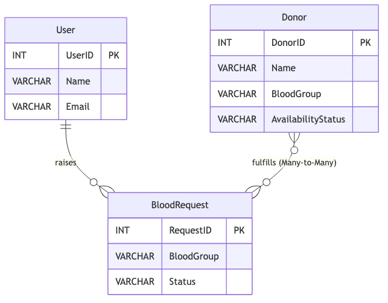

# Blood Donation Management System (DBMS Project)

A robust, PL/SQL-based Blood Donation Management System designed to manage users, donors, and blood requests with automated status tracking.

##  Project Overview
This system facilitates the matching of blood seekers with donors based on blood group and location. It uses advanced Oracle PL/SQL features like Triggers, Procedures, Functions, and Cursors to ensure data integrity and automation.

##  File Structure
```text
dbms-proj/
├── schema.sql              # Table definitions, constraints, and sequences
├── procedures.sql          # Business logic, triggers, and cursors
├── mock_data.sql           # Sample data for testing and demonstration
├── sysnopsis_dbms_project.pdf # Project documentation and report
├── images/                 # Visual documentation
│   ├── er_diagram.png      # Entity Relationship Diagram
│   └── relational_schema.png # Relational Schema Diagram
└── README.md               # Project overview and setup guide
```

##  Database Design (ER Diagram)


##  Key Features
- **Automated Donor Tracking**: A trigger automatically marks donors as 'Unavailable' once they are mapped to a request.
- **Auto-Incrementing IDs**: Uses Oracle Sequences for primary key generation.
- **Data Validation**: Strict check constraints on blood groups.
- **Reporting**: Cursor-based procedures to list pending requests with user details.

##  How to Setup
1. **Schema**: Run `schema.sql` to create tables and sequences.
2. **Logic**: Run `procedures.sql` to compile procedures and triggers.
3. **Data**: Run `mock_data.sql` to populate sample records.
4. **Demo**: Use the `ListPendingRequests` procedure to see the system in action.
